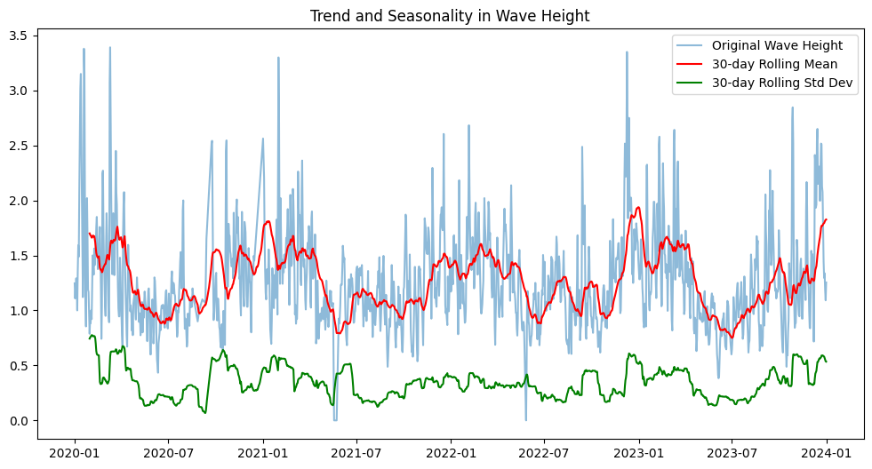
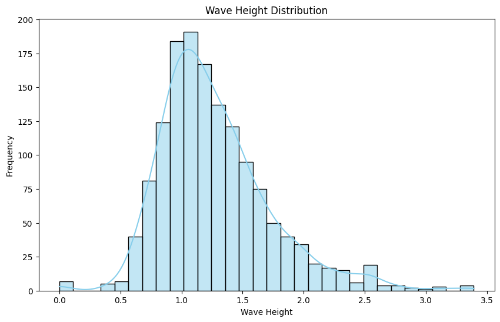
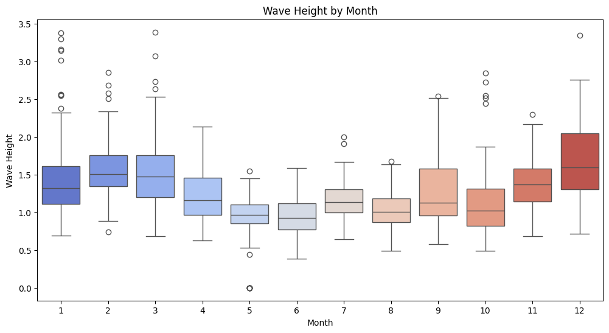
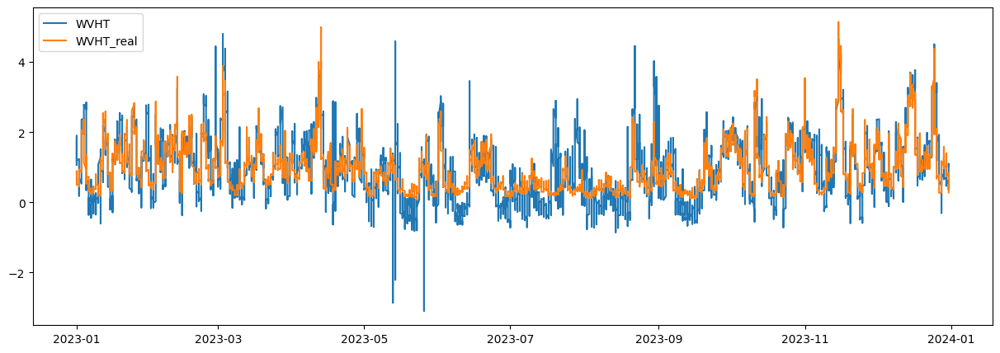
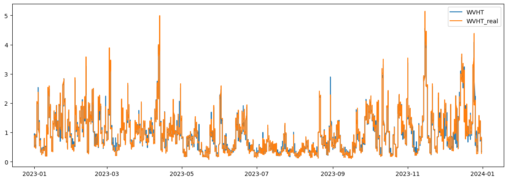
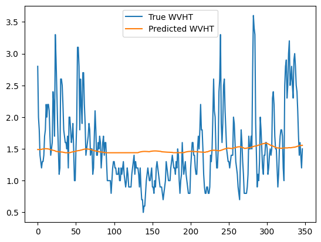
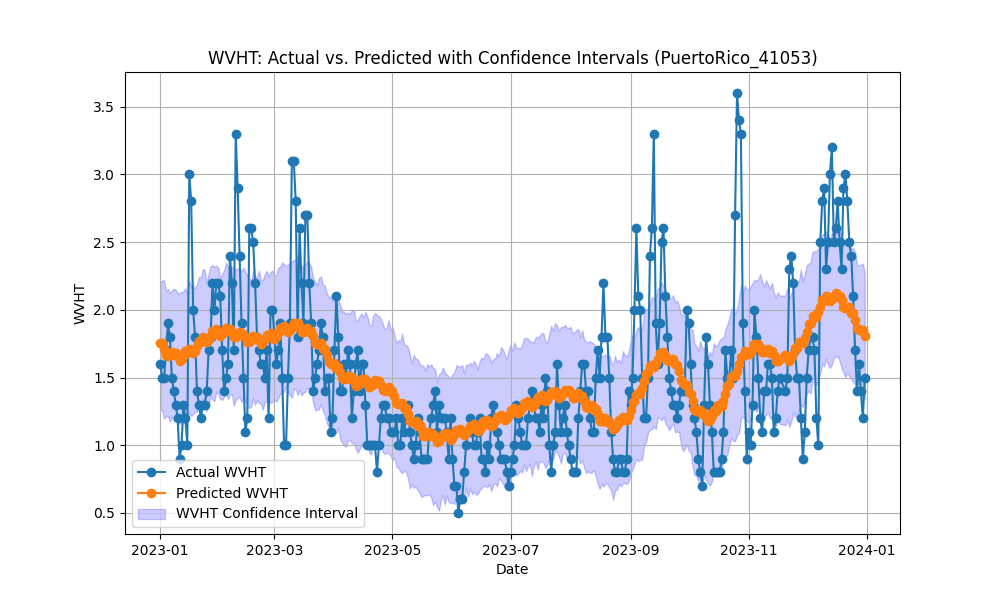
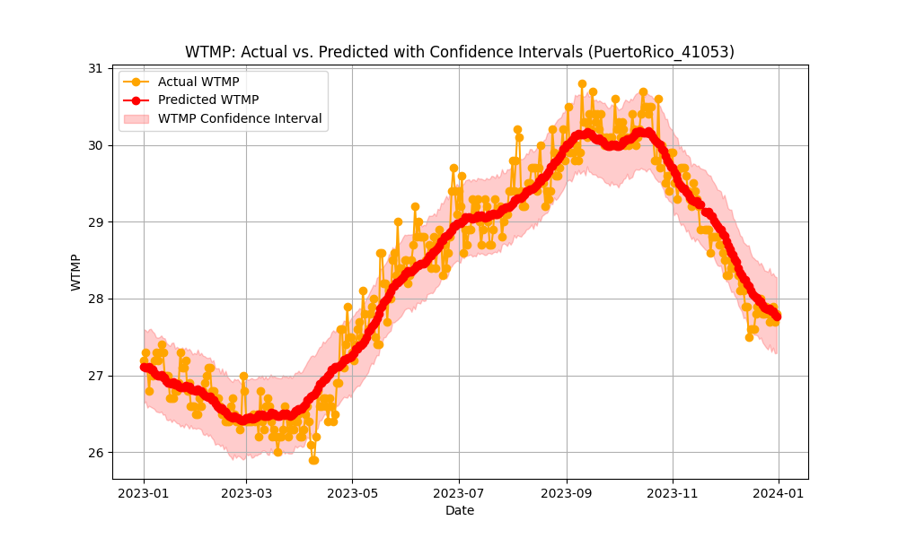
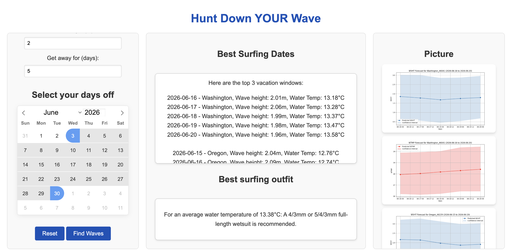

## Team Information

**Members:**  
- Chuancheng Xia  
- Ziyu Huang  
- Ruoxi Li  
- Yizhou Wang  

**Email:**  
- jwang12@bu.edu  
- mlrx@bu.edu  
- jason123@bu.edu  
- jdhuang@bu.edu

## Project Overview

### Project Title  
Predicting Wave Height Using Time-Series Model  

### Goal  
To help users identify optimal surfing locations and suitable dates based on their desired wave height and vacation periods.  

### Introduction  
This project leverages datasets from 2019 to 2023, sourced from the National Data Buoy Center (NDBC), to train a forecasting model. After data cleaning, cyclic patterns tied to time were identified, which are critical in time-series forecasting. The chosen model, Prophet, effectively captures seasonality and time-based trends, enabling predictions for wave heights from 2024 to 2026.  

The interactive webpage supports three user inputs: desired wave height, duration, and time period. Based on these, the system recommends optimal surfing dates and locations and provides water temperature predictions along with suggested surfing attire.  

Initially, alternative models were explored but Prophet was adopted after the midterm, proving to be more practical for real-world applications. Detailed discussions about the models are in the **Model** section.

## How to Build and Run the Code

1. **Install Dependencies:**  
   ```bash
   make install
2. **Process Data:**
   ```bash
   make process_data
3. **Run Model:**
   ```bash
   make run_model
4. **Run Website:**
   ```bash
   make run_website
5. **Clean:**
   ```bash
   make clean

## Data Collection and Preprocessing

The data for this project was sourced from the [National Data Buoy Center (NDBC)](https://www.ndbc.noaa.gov/), maintained by the National Oceanic and Atmospheric Administration (NOAA). After comparing various data sources based on completeness, data volume, and consistency, NDBC was selected for its extensive historical records and global coverage. The dataset includes multiple features, such as wave height, water temperature, and timestamps, which are essential for predictive modeling.

The objective of this project is to predict wave heights at specific time intervals along the U.S. coastline to provide recommendations for surfing enthusiasts. To ensure comprehensive coverage of popular surfing locations, data from multiple buoy stations along the West Coast, East Coast, South Bay, Hawaii, and Puerto Rico were selected. To maintain relevance and consistency for predictions aimed at 2025, the dataset was restricted to the most recent four years (2019–2023).

### Challenges and Solutions
- **Incomplete or Inconsistent Data Spans:**  
  Many stations had incomplete or inconsistent time spans, necessitating a thorough screening process to identify stations with complete data for the chosen period.

- **Invalid or Missing Values:**  
  A significant proportion of the data contained invalid or missing values for critical features, such as wave height and water temperature (e.g., placeholder values like `99` or `NaN`).  

To address these issues, only stations with valid and consistent historical data for the required features were included in the final dataset. This rigorous selection process ensures the reliability and accuracy of subsequent predictive modeling.

## Data Processing

### Convert TXT to CSV  
Since all the original data is in `.txt` format, we first convert it to `.csv` format for subsequent processing. We created a function called `convert_txt_to_csv(input_folder, output_folder)` to perform this conversion. By using this function, all the raw `.txt` data in the `RawWaveData` folder is converted into the `CSV_version_WaveData` folder. During the conversion, we retained only the columns essential for our model: `#YY`, `MM`, `DD`, `WVHT`, `ATMP`, and `WTMP`.

### Merge CSV Files for Each Station  
Since all raw data is stored in annual units, we combined the data for each site into a single file to make it easier for the model to process later. This was achieved using the `merge_csv_files_in_subfolders(input_folder, output_folder)` function. With this function, each site now has one `.csv` file containing all its data from multiple years, stored in the `MergedData` folder.

### Clean the Data  
1. **Remove Invalid Values:**  
   We created a function called `drop_invalid_values(data, column, threshold=99)` to remove invalid data, such as `99` for `WVHT`.  
   
2. **Create a Date Column:**  
   This function also combines the `#YY`, `MM`, and `DD` columns into a single `date` column, which is particularly useful for building the webpage.

3. **Retain Maximum Wave Height Per Day:**  
   A function called `keep_max_wvht_per_day(data)` was implemented to keep only the row with the maximum `WVHT` (Wave Height) for each day. For long-term analysis, summarizing data into daily intervals helps improve model performance. Retaining maximum values ensures that extreme events, which are significant for predictions, are not lost in the averaging process.

4. **Save Cleaned Data:**  
   The cleaned data files were saved in the `CleanedData` folder, making them ready for use in modeling.

## Visualization of Data

### Correlation Matrix
A correlation matrix was used to identify relationships between features, such as wave height and water temperature, across the dataset. 


### Wave Height Over Time 

1. **Seasonal Trends:**  
   - The 30-day rolling mean (red line) reveals clear periodic fluctuations in wave height.  
   - Peaks in the rolling mean are observed at consistent intervals, suggesting a seasonal pattern likely influenced by weather changes, such as seasonal storms or varying wind speeds.  
   - Wave heights exhibit higher values during certain periods of the year, indicative of predictable cycles.  

2. **Volatility in Wave Height:**  
   - The 30-day rolling standard deviation (green line) captures variations in wave height over time.  
   - Periods of higher wave height (as seen in the rolling mean) coincide with increased volatility, indicating that extreme wave events are more common during these periods.  

3. **Long-Term Trend:**  
   - Over the observed timeframe, there is no evident long-term increase or decrease in average wave height.  
   - Localized trends, such as short-term increases or decreases in the rolling mean, may reflect temporary weather phenomena.  

4. **Extreme Events:**  
   - The original wave height data (blue line) shows frequent spikes that rise significantly above the rolling mean, representing extreme events such as storms or cyclones.  
   - These events occur sporadically and contribute to observed volatility in wave height.  

5. **Cyclic Behavior:**  
   - A repeating cycle of wave heights aligns with seasonal weather patterns, possibly linked to factors such as wind patterns, atmospheric pressure changes, or ocean currents.  

---

### Wave Height Distribution

1. **Right-Skewed Distribution:**  
   - Wave heights are heavily skewed to the right, with smaller wave heights (around 1.0 unit) being far more frequent than larger wave heights.  
   - This is consistent with the box plot, where most months have medians near 1.0 unit.  

2. **Frequency of Extremes:**  
   - Extreme wave heights (greater than 2.0 units) occur infrequently, making them outliers in the dataset.  

3. **Mode of Wave Height:**  
   - The mode of the distribution is around 1.0, suggesting that the most common wave height across all months is approximately this value.  

4. **Uniformity Across Seasons:**  
   - While the histogram provides a global view of wave heights, the seasonality shown in the box plot indicates that this global distribution combines distinct seasonal behaviors:  
     - **Summer:** Contributes to the narrow peak near 1.0.  
     - **Winter:** Contributes to the long tail of higher wave heights.  

---

### Box Plot of Wave Height by Month

1. **Seasonal Variations:**  
   - Wave heights show clear seasonal patterns:  
     - Higher wave heights are observed in winter months (e.g., December, January, and February).  
     - Lower wave heights are predominant in summer months (e.g., June, July, and August).  

2. **Spread of Wave Heights:**  
   - The spread (interquartile range) is wider during winter months, indicating greater variability in wave heights.  
   - Summer months exhibit a narrower range, suggesting more stable wave conditions.  

3. **Extreme Events:**  
   - Winter months (especially January and December) have more outliers, representing occasional extreme wave events.  
   - Summer months have fewer outliers, with wave heights clustering closer to the median.  

4. **Trend Insight:**  
   - This seasonal trend aligns with expected environmental patterns, where winter storms and stronger winds contribute to higher and more variable wave heights.

## Model

#### Model1(Create before midterm but not used in the final work)  
In this model, we successfully predicted the relatively accurate wave height by using a large number of features such as Wind Direction (WDIR), Average Wind Speed (WSPD), Maximum Gust Speed (GST), Dominant Period (DPD), Average Period (APD), Main Wind Direction (MWD), Air Temperature (ATMP) and Water Temperature (WTMP). In order to get more accurate wave height, we try two different model which are linear regression model and Random Forest model.  

### Multiple linear regression model  
The model’s mean squared error (MSE) is 0.09983868755979808, representing the average squared difference between the predicted and actual values. A lower MSE value indicates that the model's predictions are close to the true values, suggesting good predictive accuracy.  

#### Conclusion  
The multiple linear regression model effectively revealed that the dominant period and mean wind speed are the key factors affecting wave height prediction, while other variables such as wind direction, air pressure and water temperature also have a certain impact on wave height, but to a relatively small extent. This analysis provides an important scientific basis for understanding and predicting wave height.  

### RandomForestRegressor  
Mean Squared Error (MSE): 0.0034733644264875645  
The application of the Random Forest model in wave height prediction has significantly improved model performance. Compared to the multiple linear regression model, the Random Forest model's mean squared error is only 0.0034733644264875645, much lower than the linear regression model's 0.09983868755979808. This result indicates that the Random Forest model has a stronger advantage in handling complex nonlinear relationships and interactions between variables. The advantage of the Random Forest model lies in its ability to capture nonlinear relationships in the data while reducing the risk of overfitting through the integration of multiple decision trees, thereby enhancing the model's generalizability. Consequently, the Random Forest model is more reliable for wave height prediction and can provide more accurate results for oceanographic research and practical applications.  

#### Conclusion:  
The Random Forest model has demonstrated excellent performance in wave height prediction tasks, especially in handling complex data relationships, outperforming the traditional multiple linear regression model. This provides a basis for selecting a more suitable model in practical applications. In future work, further exploration of parameter tuning for the Random Forest model could be undertaken to achieve even higher prediction accuracy. Additionally, combining the Random Forest model with other machine learning methods could be considered to enhance the accuracy and robustness of wave height predictions.  

We considered that if we wanted to use the model before the midterm to make predictions, we would need real-time feature information, such as water temperature, air temperature, wind direction and wind speed. Therefore, without using some methods to obtain data from other places, these data need to be provided by the user. However, it is obvious that this kind of information is difficult for most people to obtain, and if they already know this information, they will probably also know the real-time wave height. Therefore, this model is not of great significance for practical application. This is why we decided to use the time-series model after the midterm, that is, to use only time, which is an easily accessible feature for users, to predict. This makes our model more meaningful in terms of practical application.  

### Other model we try: LSTM  
Reference: (Long Short-Term Memory (Sepp Hochreiter and Jürgen Schmidhuber), In Neural Computation, volume 9, 1997.  

#### Model Description:  
For this model, I combine the time feature. The year, month, and day columns are combined into a single datetime column for easier handling and time-based sorting. Then, construct a sequential LSTM model.  
- Layer 1: LSTM layer with 50 units, returning sequences for stacking.  
- Output Layer: A dense layer with 1 unit for predicting the next day’s WVHT.  
- The model uses the Adam optimizer and mean squared error (MSE) loss function, both suitable for regression tasks.  

#### Problem and reflection  
This model tends to predict a relatively constant wave height to minimize the Mean Squared Error (MSE). However, this approach to reducing MSE does not align with our objectives, as it fails to accurately capture the dynamic variations in wave height.  
By focusing on minimizing MSE, the model might prioritize predicting average values, which reduces errors in regions of stable wave heights but ignores the critical fluctuations and extremes present in the data. These variations are essential for practical applications, such as forecasting hazardous conditions or understanding seasonal trends.  
For instance, while the MSE might appear low, this could simply indicate that the model has averaged out the peaks and troughs in the wave height data, leading to predictions that do not reflect reality. Such an outcome may result in underestimating or completely missing extreme wave events, which are often the primary concern for maritime safety and coastal management.  
To meet the desired objectives, the model should focus not just on minimizing MSE but also on effectively capturing the full range of wave height dynamics, including seasonal patterns and short-term volatility.  

---

### Final model: Prophet ([https://facebook.github.io/prophet/](https://facebook.github.io/prophet/))  

#### Data Source and Structure:  
The data originates from CSV files in the CleanedData directory, each presumably corresponding to a particular station. Each file contains columns for date components (#YY, MM, DD), wave height (WVHT), and water temperature (WTMP). After reading in each file, we combine the year, month, and day columns into a single datetime column.  

#### Feature Inspection and Considerations:  
- Date/Time (datetime): Acts as the primary index for forecasting. Seasonality and time-based patterns are key in time series forecasting.  
- Wave Height (WVHT): This is one of the main target variables. We assume that wave height is affected by seasonal patterns and possibly by water temperature.  
- Water Temperature (WTMP): Another target, also used as a regressor for wave height. Given that Prophet allows adding regressors, WTMP is introduced as a potential explanatory variable for WVHT.  

#### Missing and Invalid Data Handling:  
- The model checks if WVHT or WTMP are missing. If they are not present, that station file is skipped.  
- Invalid WTMP values (like 999) are filtered out. This ensures the training data for temperature forecasting is consistent and does not include placeholder or erroneous values.  

#### Target Variables:  
- WTMP (Water Temperature): Modeled first. This is forecast independently to then serve as a known regressor for the second model. We also want to use this data in the front end to suggest suitable clothing for travelers.  
- WVHT (Wave Height): Modeled second, using the predicted WTMP values as an external regressor. The rationale is that wave height might be influenced by water conditions, including temperature, so incorporating predicted WTMP could improve WVHT forecasts.  

#### Chosen Features:  
- Time (ds): Essential for Prophet’s time series modeling.  
- Yearly Seasonality: Chosen by default with Prophet. Since marine variables often have strong seasonal patterns, yearly seasonality was enabled.  
- WTMP as Regressor for WVHT Model: Selected because water temperature variations are likely correlated with wave conditions. Prophet supports adding regressors easily, making this choice a natural step. Using WTMP as a regressor, the MSE for WVHT typically reduced 0.001, which is a small effect. As we are running the model again in the front end, adding other regressor with minimal impact on accuracy will add to the run time and undermine user experience.  

---

### Why Prophet?  
The chosen model for both WTMP and WVHT is Facebook Prophet (now known as prophet). Prophet is a widely-used forecasting library that simplifies time series forecasting by:  
- Automatically handling seasonality (weekly, yearly).  
- Providing credible intervals for forecasts.  
- Being relatively straightforward to implement, tune, and interpret.  

#### Tuning Parameters:  
- Yearly Seasonality: Set to True, which likely improves the model for marine conditions that vary seasonally.  
- Interval Width: Set to 0.90 for the WTMP model and 0.70 for the WVHT model. This controls the uncertainty interval width. For water temperature, users likely value more precise and reliable information because temperature fluctuations can have significant impacts. For wave height, users might prioritize a tighter range (narrower interval) to avoid overly broad predictions that could be less actionable. For example, a range of “0 to 3 meters” might be too vague for decision-making.  

#### Metrics:  
- Mean Absolute Error (MAE): This metric measures the average magnitude of forecast errors. The code calculates MAE for both WVHT and WTMP predictions.  
- The lower the MAE, the closer the predictions are to the actual observed values.  

MAE is easy to interpret and robust to outliers compared to Mean Squared Error. In forecasting tasks, MAE directly relates to the absolute deviation from the actual values.  

The MAE varies between 0.3 to 0.8 for our model, as different sites have different variations and patterns.  
Please refer to the plots folder after running the code for the model performance visualization.  
Here is a sample of our model on Puerto Rico:  
 
 
## Webpage

### Integration of Prediction Results with Frontend
The integration of prediction results with the frontend is a crucial aspect of ensuring a smooth user experience. In this application, the backend (`app.py`) processes user inputs, generates predictions and plots, and then dynamically updates the frontend interface to display the results interactively.

### Data Flow between Backend and Frontend
1. **User Input:**  
   - The frontend collects user input via a form (wave height, number of days, date range) and sends it to the `/get_predictions` route as a POST request using Axios.

2. **Processing and JSON Response:**  
   - The backend processes the request, identifies the top three prediction windows, generates plots, and packages the results in a JSON response. This includes:
     - Surf station ID.
     - Date range for each window.
     - Plot URLs pointing to the prediction plots stored in the `static/prediction_plots` directory.
     - Outfit suggestions based on average water temperature.

3. **Dynamic Button Generation:**  
   - The frontend dynamically creates buttons for the top three prediction windows. Each button represents a specific window, labeled with its station ID and date range.
   - Clicking on a button triggers a JavaScript function (`displayPlot`) to update the right section of the page with the corresponding plot.

### JavaScript for Button Functionality
The JavaScript function `displayPlot(stationId, plotUrl)` is central to the integration:
- When a user clicks a button:
  - The station ID and plot URL of the selected window are passed to `displayPlot`.
  - The plot image for the selected window is displayed in the right section of the webpage.

#### Code Example:
```javascript
function displayPlot(stationId, plotUrl) {
    const imageBox = document.getElementById("imageBox");
    imageBox.innerHTML = ``;
}
```

### Frontend Button Creation

Upon receiving the JSON response, the frontend generates buttons for the top three prediction windows:

- **Button Rendering:**  
  - Each button includes the station ID and date range for a window.  
  - When clicked, it invokes `displayPlot` with the plot URL corresponding to the selected window.

### Real-Time Plot Updates

- Clicking on a button updates the right section (`imageBox`) with the corresponding plot.  
- The prediction plots for the top three windows are saved dynamically by the backend during the processing phase using Matplotlib.

### Summary

By combining dynamic button creation and interactive plot rendering, the application provides users with an intuitive way to visualize predictions and make informed surfing plans. This integration bridges the backend computations with the interactive user interface, ensuring a seamless experience for users.

## Outcome

The webpage generates tailored recommendations for surfing based on user input. It identifies the optimal time periods and surfing locations with wave heights that most closely match the user's desired wave height within their specified time frame. Additionally, the platform predicts water temperatures and provides outfit recommendations based on these predictions, ensuring a comfortable and safe surfing experience. The website also includes visualizations, presenting detailed plots of predicted wave heights and water temperatures over time, offering users a comprehensive and interactive planning tool.

## Future Research

Future scholars can build upon this research by exploring related questions that delve deeper into unresolved issues or gaps in understanding. For instance, they could investigate the broader implications of the findings across different contexts, populations, or time periods. Employing interdisciplinary approaches or integrating emerging methodologies, such as advanced data analysis techniques or experimental designs, could provide new insights. Additionally, comparative studies or longitudinal research may shed light on trends and variations over time. Collaborating across diverse fields or regions can also enhance the scope and applicability of future research, fostering a richer and more nuanced understanding of the subject.

For practical application, the website could be expanded to include more stations, providing broader coverage and improving accuracy. Additionally, the platform could be developed into a mobile app, making it more accessible and user-friendly for a wider audience.
